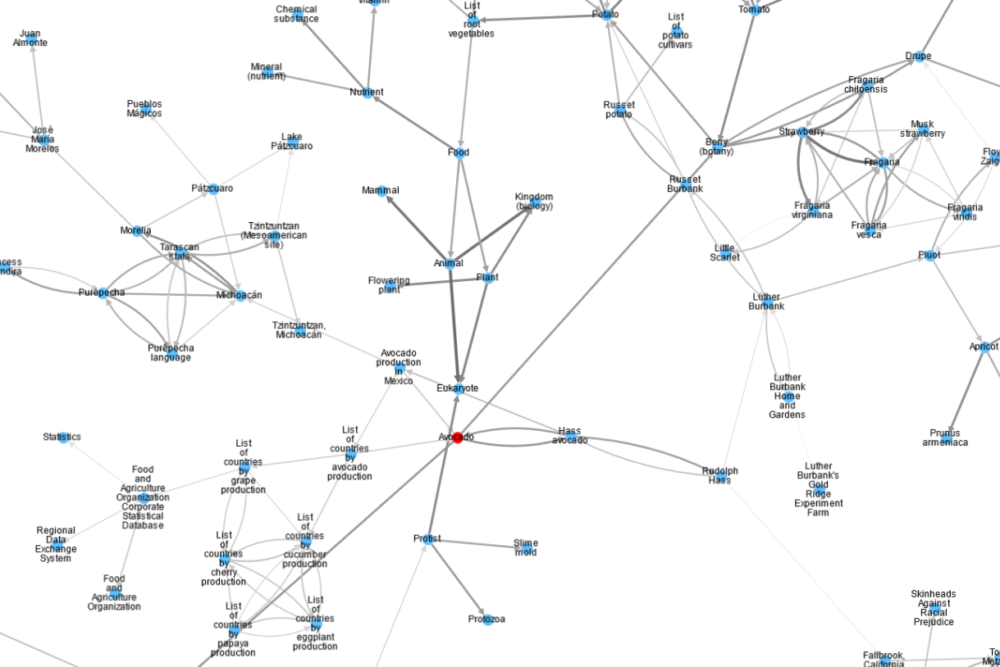

# Akka Streams Workshop

This is the repo of an Akka Streams workshop.
You can jump right in by going to the [`AkkaStreamsIntro`](src/main/scala/ncreep/AkkaStreamsIntro.scala) file.

# Background
In this workshop we are going to use Akka Streams to solve some streaming problems. If you follow along the workshop you'll get to generate pretty pictures like this one:

The workshop assumes some basic knowledge of Akka Streams, though we start with a short recap just to make sure we are on the same page.

Despite the title, this workshop is not about Akka Streams specifically, but rather about how to apply streaming techniques to solve problems. As such, the workshop doesn't delve into the depths of the Akka Streams library and uses mostly basic streaming functionality. For more in depth documentation of Akka Streams you can take a look at the [official documentation](https://doc.akka.io/docs/akka/current/stream/index.html). 

Given the above, it should be relatively straightforward to translate this workshop to other streaming libraries (or even languages). Reach out if you're interested in doing so.

